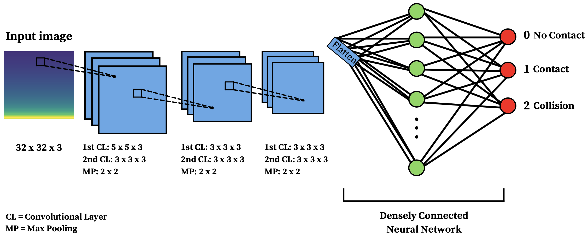
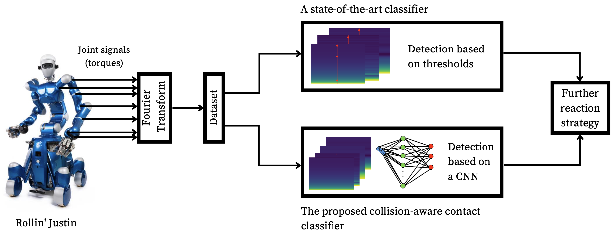
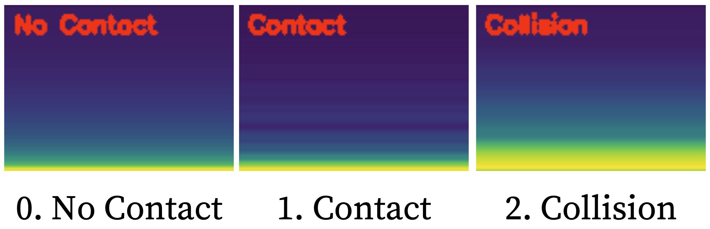

# Collision-aware Contact Classification

This framework provides the full pipeline for a collision-aware contact classifier that reads torque data as spectrograms created using the Fourier Transform, and returns an evaluation of whether a collision or a contact is occuring, or whether there is no intersection at all.

## Overview

In the following, the structure of the framework is described in details and a manual for easy implementation is provided.

Table of Contents:
* [Preparations](#preparations)
* [The Dataset](#the-dataset)
* [The Framework](#the-framework)
* [The State-of-the-art Classifier](#the-state-of-the-art-classifier)
* [Tensorboard Logs](#tensorboard-logs)
* [Optimisation Documentation](#optimisation-documentation)
* [Output Models](#output-models)
* [Generating Data](#generating-data)
* [Prediction](#prediction)
* [Run the Framework](#run-the-framework)
* [Results](#results)

## Preparations

This section describes all necessary steps to create the correct working environment that ensures the functionality of this framework.

It is recommended to first create a virtual environment, so that already existing systems or data on a device are not disturbed. The following steps need to be taken in order to estblish the right environment for the classifier. It is expected that the latest version of Python 3.8 is already installed, together with pip.

### 1. Install Virtualenv:

```
$ pip3 install virtualenv virtualenvwrapper
```

### 2. Edit `~/.bashrc` profile

```
$ vim ~/.bashrc
```
and then:
	
```	
# virtualenv and virtualenvwrapper
export WORKON_HOME=$HOME/.local/bin/.virtualenvs
export VIRTUALENVWRAPPER_PYTHON=/usr/bin/python3
export VIRTUALENVWRAPPER_VIRTUALENV=$HOME/Library/Python/3.8/bin/virtualenv
source $HOME/Library/Python/3.8/bin/virtualenvwrapper.sh
```
### 3. Source venv

```
$ source ~/.bashrc
```

### New terminal commands:

* Create an environment with `mkvirtualenv`
* Activate an environment (or switch to a different one) with `workon`
* Deactivate an environment with `deactivate`
* Remove an environment with `rmvirtualenv`

More information can be found [in the docs.](https://virtualenvwrapper.readthedocs.io/en/latest/)

### 4. Create new venv:

```
$ mkvirtualenv classifier -p python3
```

### 5. Install packages:

```
$ workon classifier
$ pip install opencv-contrib-python
$ pip install numpy
$ pip install scikit-learn
$ pip install scikit-image
$ pip install imutils
$ pip install matplotlib
$ pip install tensorflow # or tensorflow-gpu
```

### Note:

A virtual environment is not necessary in order to run the framework, however, it is recommended in order to protect the data and devices.

If working without a virtual environment, please make sure that all necessary libraries are installed. If not, install them as follows:

```
$ pip3 install opencv-contrib-python
$ pip3 install numpy
$ pip3 install scikit-learn
$ pip3 install scikit-image
$ pip3 install imutils
$ pip3 install matplotlib
$ pip3 install tensorflow # or tensorflow-gpu
```

It is essential that all these packages are installed before running the classifier, so that no errors occur.

## The Dataset
The directory `data` contains the entire dataset that is used to train and test the collision-aware contact classifier. It is divided into:

* `Meta`: This stores a clean image of each contact class that corresponds with the `Meta.csv` file.
* `Train`: Here, the images are grouped by their contact class and given a separate directory. Each class shows 1,134 images of one single contact state from different joints and logs, which are all annotated in `Train.csv`.
* `Test`: This directory consists of 690 images (230 per class) to test and evaluate the accuracy of the model. Some of these images include contact states that might be easily misclassified because of their resemblance with other contact states to see if the network is trained well enough. The images are annotated in `Test.csv`
* `Predict`: This is an example directory for applying the classifier to new and unknown data to predict the correct contact label, which is connected to the `Predict.csv` file.

The structure of the dataset is simple to support further extensions. The file `labels.csv` includes the information about the three possible contact classes: 

* 0: No Contact
* 1: Contact
* 2: Collision

Each image is only labelled as one of these contact states.

## The Framework

The directory `framework` will offer the neccessary functions and methods needed in order to build, train, test, and optimise the convolutional neural network (CNN). The functions can also be used to instantly generate new data to predict labels.

The architecture of the CNN is shown in the image below:



The framework can be used by specifying the intentions through the arguments in the Terminal. The files are created in an object-oriented structure to establish a clear infrastructure. The files work as follows:

* `arguments.py`: specify the arguments that are passed to `main.py`,
* `build_model.py`: build the CNN layer by layer,
* `evaluating.py`: evaluate and test the trained classifier,
* `helper`: provide helping functions that can be used by each class,
* `inner_opt.py`: establish the inner optimisation method,
* `main.py`: run the framework as commanded through the Terminal,
* `predicting.py`: predict the labels of new images,
* `preprocessing.py`: process the images and prepare them for the training, testing, or prediction processes,
* `read_data.py`: instantly generate new data,
* `training.py`: train the classifier,
* `tuning.py`: optimise the classifier with one of the three optimisation methods.

## 3. The State-of-the-art Classifier

As further described in the thesis, a state-of-the-art classifier is created at the beginning to later compare it with the performance of the novel classifier. 

The image below shows the functionality of both classifiers:



The threshold classifier is implemented by using grayscale values. The code is saved in the `threshold_classifier` directory, together with a summary of the attained results.

This classifier can be run by adjusting the image paths in the code and typing

```
$ python3 grayscale.py
```

into the Terminal.

## Tensorboard Logs

The folder `tensorboard_logs` entails all logs collected through the different training, testing, and optimisation stages of the classifier. They can be used to analyse and evaluate the performance in TensorBoard. Further instructions can be found on [Tensorboard's website.](https://www.tensorflow.org/tensorboard/)

## Optimisation Documentation

During the automatic optimisation of the collision-aware contact classifier, the three used methods (Bayesian Optimisation, Random Search, and Hyperband) documented their trials in the directory `optimisation_trials`.

## Output Models

The `output` folder consists of the saved models. As there are four different models (one without optimisation, and three with optimisation) it is necessary to separate them. With the final accuracy of over 98%, the random search model can be implemented immediately.

This is the path that needs to be passed through the main command, so that the classifier knows which model to use for the prediction of new images.

## Generating Data

Using the torque data from the `h5files` directory, a specific .h5 file can be added to the Terminal command, which will automatically create new data to predict labels.

## Prediction

The predicted images will be loaded into the folder `predictions` or, if they are attained from other directories labeled as `Predict`, will be saved in the respective directories.

## Run the Framework

In order to run the framework successfully, several steps need to be included.

### 1. Start Virtual Environment (if necessary)

```
$ source ~/.bashrc
$ workon classifier
```

### 2. Change directories

```
$ cd collision_aware_cc/framework
```

### 3. Specify arguments:
There are 6 arguments that need to be added when running the code. The `class Args()` can be seen in `arguments.py`. 

The main structure of a command is as follows:

```
$ python3 main.py -m -op -inop -d -pr -tr
```
where all arguments are optional. The arguments are described below:

* `-m` or `--model` to add the path to the output model,
* `-op` or `--optimiser` to add the optimisation methods to use, can be either `bayesian`, `random`, or `hyperband`,
* `-inop` or `--inner_optimiser` to add the inner optimisation method, can be either `adam`, `sgd`, or `rms`,
* `-d`or `--dataset` to add the path to the input dataset for training and testing the classifier,
* `-pr`or `--predictions` to add the path to the output prediction directory or add a `.h5` file from the `h5files` directory for instant data generation,
* `-tr` or `--train` to indicate the number of hyperparameters to optimise during the training process, or to skip the training entirely to just predict labels, can be either `all`, `one`, `none`, or `pred`.

### 4. Run command in the Terminal

The framework can be run through a command in the terminal. The `main.py` file will only run with the correct arguments. 

The following command will train and test the neural network with the assigned dataset without any optimisation:

```
$ python3 main.py --model ../output/neural_net.model --dataset ../data --predictions ../predictions --train none
```

When optimising the neural network, add the `optimiser` argument as shown below.

### 5. Run optimisations

#### Bayesian Optimisation:

This command will train, test, and optimise the CNN by tuning all hyperparameters using Bayesian Optimisation and the inner optimiser Adam.

```
$ python3 main.py --model ../output/bayesian.model --optimiser bayesian --inner_optimiser adam --dataset ../data --predictions ../predictions --train all
```

If only the `learning rate` value should be tuned with Bayesian Optimisation, the argument can be changed as follows:

```
$ python3 main.py --model ../output/bayesian.model --optimiser bayesian --inner_optimiser adam --dataset ../data --predictions ../predictions --train one
```

#### Hyperband Optimisation:

This command will train, test, and optimise the CNN by tuning all hyperparameters using Hyperband Optimisation and the inner optimiser Adam.


```
$ python3 main.py --model ../output/hyperband.model --optimiser hyperband --inner_optimiser adam --dataset ../data --predictions ../predictions --train all
```

#### Random Search:

This command will train, test, and optimise the CNN by tuning all hyperparameters using Random Search and the inner optimiser Adam.


```
$ python3 main.py --model ../output/random_search.model --optimiser random --inner_optimiser adam --dataset ../data --predictions ../predictions --train all
```

Make sure to always provide the correct model path in combination with the correct optimiser. 

If a different inner optimiser is wanted, the argument can be changed to:

```
$ python3 main.py --model ../output/random_search.model --optimiser random --inner_optimiser sgd --dataset ../data --predictions ../predictions --train all
```

### 6. Run predictions only

If there is already a fully trained and optimised model that is saved on a specific path, the trianing process can be skipped, by directly using the collision-aware contact classifier to predict labels of provided images.

As the classifier is the main product of the framework, this is the default setting. Hence, by writing 

```
$ python3 main.py
```
into the Terminal, it will use the default model, in this case the CNN optimised with Hyperband, which achieves 98.0% accuracy. The framework already provides a directory with sample images that can be used as a new dataset for predictions.

This will save the predicted images in the separate `Predict` folder.

However, if a specific model is desired to be used on a specific dataset, it can be run as follows:

```
python3 main.py -m ../output/hyperband.model -pr Predict -tr pred
```

By passing a file that ends with `.h5` instead of an image directory, the framework knows that it needs to generate new data first, which will then be used to predict labels. This can be specified as follows:

```
python3 main.py -pr ../h5files/collision/log_20200916_130141.h5
```


## Results

The output in the shell will indicate the current state of the programme.

A classification report will appear with the prediction accuracy, if the training option is chosen.

The predicted images can then be viewed in the assigned folder.

The results may look like this:


